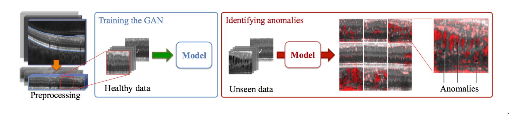
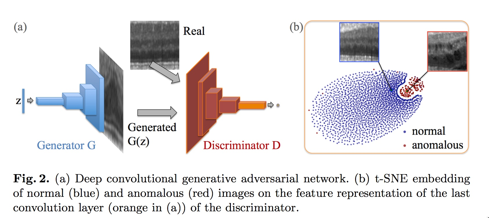
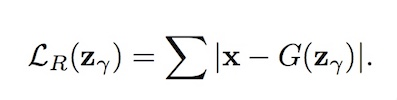
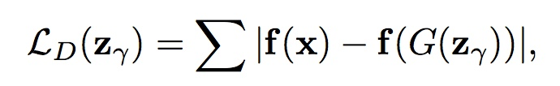
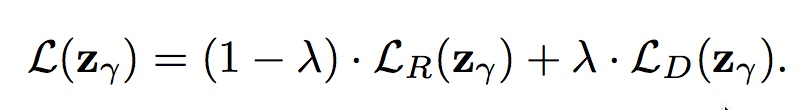

# AnoGAN in tensorflow

Tensorflow implementation of [Anomaly GAN (AnoGAN)](https://arxiv.org/abs/1703.05921).

This model detect anomaly part in images, after training DCGAN with normal dataset.

Basic model is DCGAN (Deep Convolutional Generative Adversarial Networks).

Thanks for github.com/carpedm20, cuz he share basic guide line to implement DCGAN.

Basic structure of this implementation is based on his implementations.

*(Anomaly Detection of MNIST is not yet available)

## Model Description
After learn DCGAN model with normal dataset (not contains anomalies), Anomaly Detector calculates anomaly score of unseen images.

Below picture is from the paper, describing DCGAN model and anomaly results.

When unseen data comes, the model tries to find latent variable z that generates input image using backpropagation. (similar with style transfer)

Anomaly Score is based on residual and discrimination losses.
- Residual loss: L1 distance between generated image by z and unseen test image.
- Discrimination loss: L1 distacne between hidden representations of generated and test image, extracted by discriminators.

Total Loss for finding latent variable z is weighted sum of the two. (defualt lambda = 0.1)

## File Descriptions
- main.py : Main function of implementations, contained argument parsers, model construction, and test.
- model.py : DCGAN class (containing anomaly detection function. Imple core)
- download.py : Files for downloading celebA, LSUN, and MNIST. 
- ops.py : Some operation functions with tensorflow.
- utils.py : Some functions dealing with image preprocessing.

## Prerequisites (my environments)

- Python 2.7
- Tensorflow > 0.14
- SciPy
- pillow
- (Optional) [Align&Cropped Images.zip](http://mmlab.ie.cuhk.edu.hk/projects/CelebA.html) : Large-scale CelebFaces Dataset

## Usage

First, you "must" have trained DCGAN model with normal dataset.

If you have checkpoint file, the model tries to use it.

### Model Preparation 
(If you want to download and train the model)
First, download dataset with:

    $ python download.py mnist celebA

To train a model with downloaded dataset:

    $ python main.py --dataset mnist --input_height=28 --output_height=28 --train
    $ python main.py --dataset celebA --input_height=108 --train --crop

Or, you can use your own dataset (without central crop) by:

    $ mkdir data/DATASET_NAME
    ... add images to data/DATASET_NAME ...
    $ python main.py --dataset DATASET_NAME --train
    $ python main.py --dataset DATASET_NAME
    $ # example
    $ python main.py --dataset=eyes --input_fname_pattern="*_cropped.png" --train

### Anomaly Detection
After having trained DCGAN model, you have to prepare test images for anomaly detection.

    $ mkdir ./test_data
    ... add test images to ./test_data ...
    
    $ python main.py --dataset DATASET_NAME --input_height=108 --crop --anomaly_test

## Results

